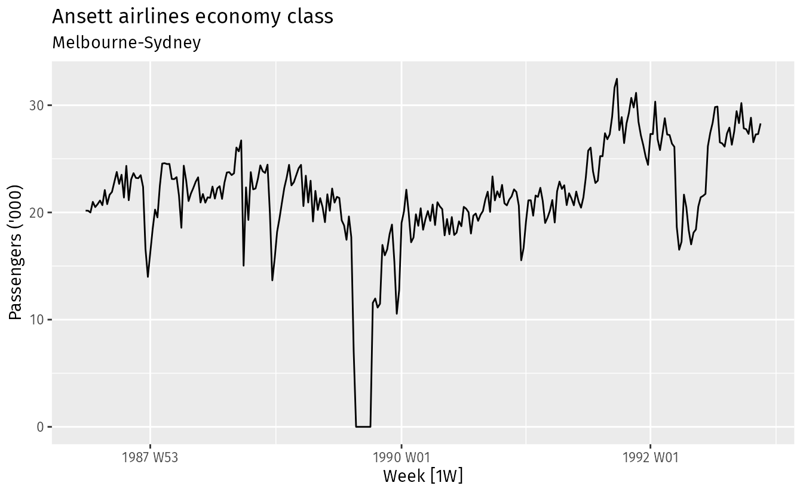
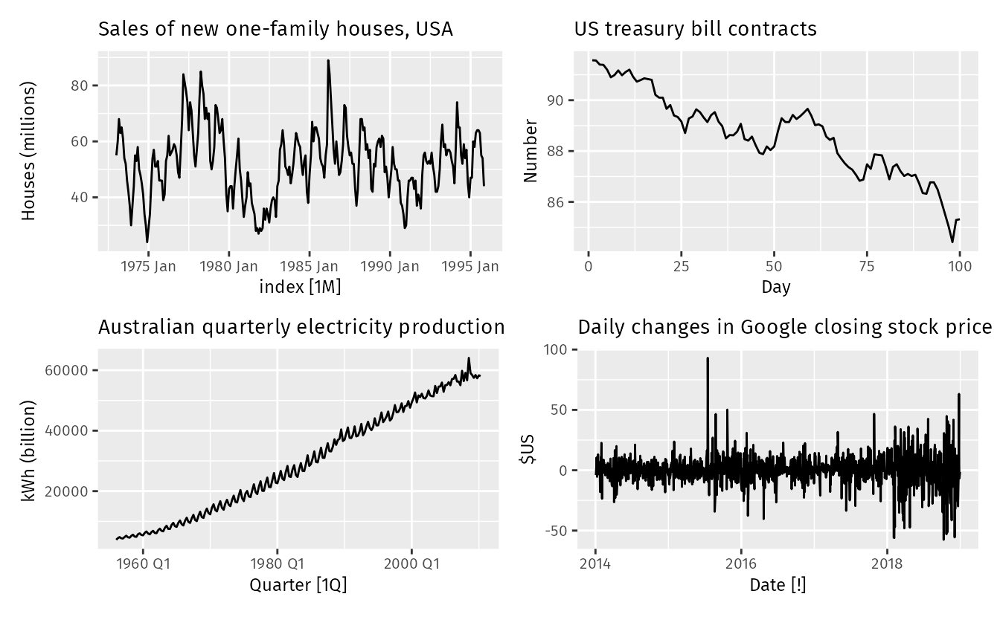

# Forecasting: Principles and Practice

---

**[Chapter 1.1: What can be forecast?]**

The predictability of an event or a quantity depends on several factors including:

- how well we understand the factors that contribute to it;
- how much data is available;
- how similar the future is to the past;
- whether the forecasts can affect the thing we are trying to forecast.

---

**[Chapter 1.1: What can be forecast?]**

A forecasting model is intended to capture the way things move, not just where things are.

---

**[Chapter 1.1: What can be forecast?]**

Sometimes, there will be no data available at all. For example, we may wish to forecast the sales of a new product in its first year, but there are obviously no data to work with. In situations like this, we use judgmental forecasting, discussed in Chapter [6](https://otexts.com/fpp3/judgmental.html#judgmental).

**The choice of method depends on what data are available and the predictability of the quantity to be forecast.** 

---

**[Chapter 1.2: Forecasting, goals and planning]**

> 预测、目标、规划，这三个名词是不同的。通常来说，将这三件事都做成，才算是一个真正work的系统。这也是时间序列预测的难以广泛落地的原因之一。

---

**[Chapter 1.3: Determing what to forecast]**

- Objects should be forecast
- Required horions
- Required frequency
- Understand the true needs
- Find or collect the data on which the forecasts will be based

---

**[Chapter 1.4: Forecasting data and methods]**

If there are no data available, then **qualitative forecasting** methods must be used. These methods are not purely guesswork—there are well-developed structured approaches to obtaining good forecasts without using historical data. These methods are discussed in Chapter [6](https://otexts.com/fpp3/judgmental.html#judgmental).

Different types of predictor functions:

- $f$ with predictor variables, $f(current\ temperature, strength\ of\ economy, population, time\ of\ dat, day\ of\ week, \mathbf{error})$, explanatory model, does not use the previous data.
- time series model $f$, $ED_{t+1}=f(ED_t, ED_{t-1}, ..., \mathbf{errors})$, does not use predictor variables
- mixed model: $ED_{t+1} = f(ED_t, current\ temperature, time\ of\ day, day\ of\ week, \mathbf{error})$

---

**[Chapter 1.6 The Basic Steps in Forecasting Task]**

**Step 1: Problem Definition:**

-  **This is usually the most difficult part of forecasting!** It requires an understanding of the way forecasts will be used, who requires the forecasts, ... It needs much time talking to everyone who will be involved in collecting data, maintaining database, and using forecasts for future planning.

**Step 2: Gathering information.**

- (i) Statistical Data and (ii) Accumulated expertise
- Often, it will be difficult to obtain enough historical data to be able to fit a good statistical model. In this case, the **judgmental forecasting** can be used. (chapter 6)
- However, remember that **good statistical models will handle evolutionary changes in the system**; **don’t throw away good data unnecessarily**.

**Step 3: Preliminary analysis.**

- Graphing the data.
- Are there consistent patterns?
- Is there significant trend?
- Is there significant seasonality?
- Are there outliers that need to be explained with expert knowledge?
- Are there strong relationships among the variables.
  - Time Graphics (Chapter 2) and Time Decomposition (Chapter 3) will be very useful.

**Step 4: Choosing and Fitting models**

- The best model depends on the many factors:
  - the availability of historical data
  - the strength of relationships between forecast variable and any explanatory variables
  - the way in which the forecasts are to be used (maybe there are some special requirements)
- It is common to compare two or three potential models. Each model has a set of assumptions (explicit and implicit), and usually involves one or more parameters which must be estimated using the known historical data.
- Regression models (Chapter 7), exponential smoothing methods (Chapter 8), Box-Jenkins ARIMA models (Chapter 9), Dynamic Regression Models (Chapter 10), Hierarchical forecasting (Chapter 11), NNs and vector autoregression (Chapter 12).

**Step 5: Using and evaluating a forecasting model.**

---

**[Chapter 1.7 The statistical forecasting perspective]**

Rather than the individual possible future data point (i.e., **point forecast**), the **prediction interval** is instead more practical, considering the uncertainty of time series. 

Further, the prediction interval is actually a part of **forecast distribution** with high confidence, e.g., 95%. When we talk about the “forecast”, we usually mean the **average value** (i.e. the data point) of the forecast distribution.

In this textbook, $\hat{y}_{t_1|t_2}$ means the forecast of $y_{t_1}$ taking acount of $y_{1},...,y_{t_2}$.

---

**[Chapter 2.2 Time Plots]**

- There was a period in 1989 when no passengers were carried — this was due to an industrial dispute. (PS: This is impossible to predict)
- A large increase in passenger load occurred in the second half of 1991.
- There are some large dips in load around the start of each year. These are due to holiday effects.
- There is a long-term fluctuation in the level of the series which increases during 1987, decreases in 1989, and increases again through 1990 and 1991.

These observations need a lot of prior knowledge. Thus, **any model will need to take all these features into account in order to effectively forecast the passenger load into the future.**

> Find related features and then design the model

Time series forecasting is now still highly hand-crafted.

---

**[Chapter 2.3 Time Series Patterns]**

Trend, Seasonal, Cyclic

**Trend:**

- **long-term** increase or decrease in the data

**Seasonal:**

- a time series is affected by seasonal factors. seasonality is always of a **fixed and known period.**

**Cyclic:**

- a time series exhibits rises and falls that are **not of a fixed frequency.** the average length of cycles is longer thatn the length of a seaonal pattern.

左上： Seasonal + Cyclic； 右上： Trend； 左下：Trend + Seasonal； 右下：random fluctuations which do not appear to e very predictable.

---

**[Chapter 9.1 - ARIMA - Stationarity and Differencing]**

A stationary time series is one whose statistical properties do not depend on the time at which the series is observed. Thus, **time series with trends, or with seasonality, are not stationary — the trend and seasonality will affect the value of the time series at different times**. On the other hand, **a white noise series is stationary** — **it does not matter when you observe it**, it should look much the same at any point in time.

**The forecasts from a random walk model are equal to the last observation, as future movements are unpredictable.** (这可能是为什么现有的方法，在没什么模式的基础上，预测的是均值)

**Sometimes it is necessary to take both a seasonal difference and a first difference to obtain stationary data.** (ARIMA需要先把数据处理成平稳的)

---

**[Chapter 9.3 Autoregressive Models]**

We normally restrict autoregressive models to stationary data, in which case some constraints on the values of the parameters are required.

- For an AR(1) model:  $−1<\phi_1<1$.
- For an AR(2) model: $−1<\phi_2<1,$ $\phi_1+\phi_2<1$, $\phi_2-\phi_1<1$

When $p≥3$, the restrictions are much more complicated. The `fable` package takes care of these restrictions when estimating a model.

---

**[Chapter 9.3 Moving Average Models]**

AR(1)可以转换成MA($\infin$)，MA(1)可以转化成AR($\infin$)。

这个转换有意义的前提是$MA(1)=e_t + \theta_1e_{t-1}$中的$|\theta_1|<1$。这也是为什么我们要求数据是平稳的。

The invertibility constraints for other models are similar to the stationarity constraints.

- For an MA(1) model: $-1<\theta_1<1$.
- For an MA(2) model: $-1<\theta_2<1$, $\theta_1+\theta_2>-1$, $\theta_1-\theta_2<1$

More complicated conditions hold for $q≥3$. Again, the `fable` package will take care of these constraints when estimating the models.

